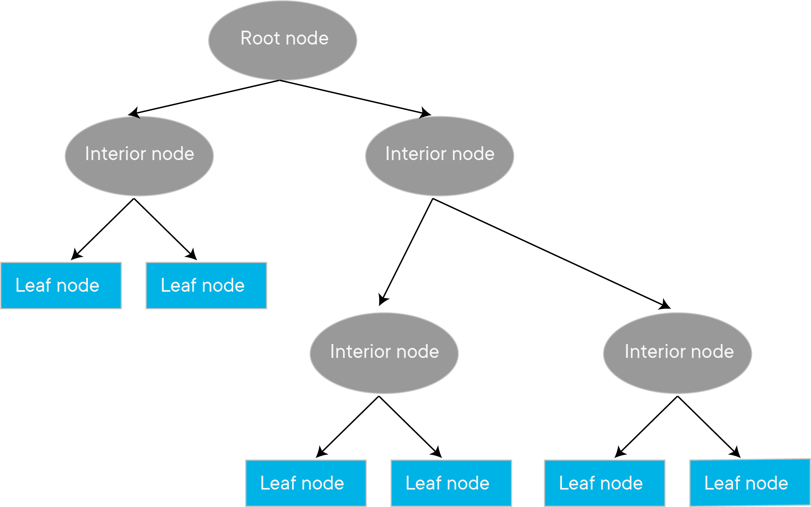
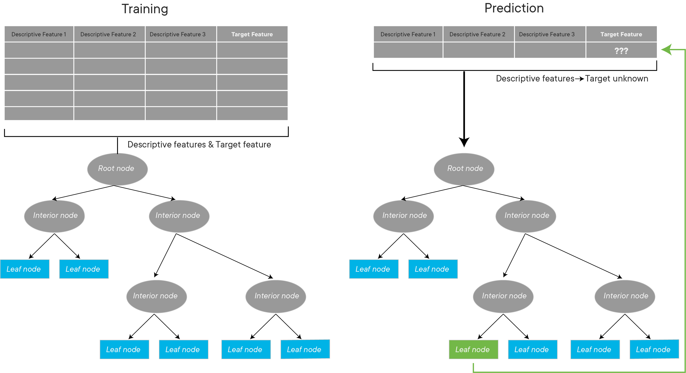
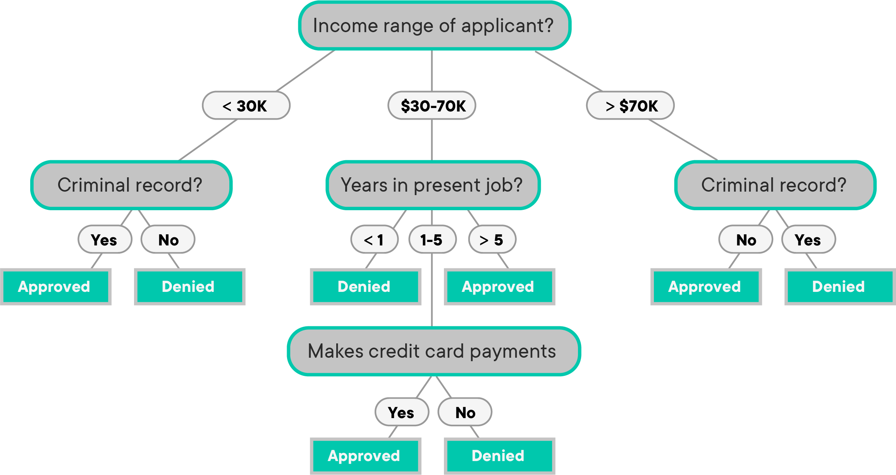

# Introduction to Decision Trees

## Introduction

In this lesson, we'll take a look **_Decision Tree Classifiers_**. These are rule-based classifiers and belong to the first generation of modern AI. Despite the fact that this algorithm has been used in practice for decades, its simplicity and effectiveness for routine classification task is still on par with more sophisticated approaches. They are quite common in the business world, because they have decent effectiveness without sacrificing explainability. Let's get started!

## Objectives

You will be able to:
- Understand and describe a decision tree algorithm in terms of graph architecture
- Describe how decision trees are used to create partitions in a sample space
- Have an overview of the training and prediction stages involved decision tree classification
- Understand the importance of a cost function for decision trees

## From Graphs to Decision Trees

We have seen basic classification algorithms (a.k.a classifiers), including Naive Bayes and sigmoid based logistic regression in earlier lessons. A decision tree is somewhat different type of classifier that performs through a **recursive partition of the sample space**. In this lesson, we shall get a conceptual understanding of how this is achieved. 

A decision tree comprises of decisions that originate from a chosen point in sample space. In terms of a graph theoretic understanding (recall the graph section), it is a **directed acyclic graph with a root called "root node" that has **no incoming edges**. All other nodes have one (and only one) incoming edge. Nodes having outgoing edges are known as **internal**nodes. All other nodes are called **leaves** . Nodes with an incoming edge, but no outgoing edge are called **terminal nodes**. 

>__Directed Acyclic Graphs__

> In computer science and mathematics, a directed acyclic graph (DAG) is a graph that is directed and without cycles connecting the other edges. This means that it is impossible to traverse the entire graph starting at one edge. The graph is a topological sorting, where each node is in a certain order.

## Partitioning the Sample Space

So a decision tree is effectively a DAG as the one seen above where **each internal node partitions the sample space into two (or more) sub-spaces** according to some discrete function of the input attributes values. 

In the simplest and most frequent case, each internal node considers a single attribute so that space is partitioned according to the attribute’s value. In the case of numeric attributes, the condition refers to a range. Let's see a bit more on this with a simple example below.

So this is the basic idea behind decision trees , every internal node checks for a condition and performs a decision. Every terminal/lead node represents a discrete class. Decision tree induction is closely related to **rule induction**. In essence a decision tree is a just series of IF-ELSE statements (rules). Each path from the root of a decision tree to one of its leaves can be transformed into a rule simply by combining the decisions along the path to form the antecedent part, and taking the leaf’s class prediction as the class value.

## Definition
> A decision tree is a DAG type of classifier where each branch node represents a choice between a number of alternatives and each leaf node represents a classification. An unknown (or test) instance is routed down the tree according to the values of the attributes in the successive nodes. When the instance reaches a leaf, it is classified according to the label assigned to the corresponded leaf.

A real dataset would usually have a lot more features than the example above and will create much bigger trees, but the idea will remain exactly the same. The idea of feature importance is of high importance as selecting the correct feature to make a split that define complexity and effectiveness of the classification process. Regression trees are represented in the same manner, just they predict continuous values like price of a house. 

## Training Process

The process of training a decision tree and predicting the target features of query instances is as follows:

1. Present a dataset of training examples containing features/predictors and a target. (similar to classifiers we have seen earlier)

2. Train the tree model by making splits for the target using the values of predictors. The predictor to use gets selected following the idea of feature selection and uses measures like "__information gain__" and "__gini index__" etc. We shall cover these shortly. 

3. Tree is grown until some __stopping criteria__ is achieved. This could be a set depth of the tree or any other similar measure. 

4. Show a new set of features to the tree, with an unknown class and let the example propagate through a trained tree. Resulting leaf node represents the class predictions this data. 

## Splitting Criteria

The training process of a decision tree can be generalized as "__Recursive binary Splitting__".  
>In this procedure all the features are considered and different split points are tried and tested using some __Cost Function__. The split with the lowest cost is selected. 

There are couple of algorithms there to build a decision tree:

* __CART (Classification and Regression Trees)__ uses Gini Index as a metric.
* __ID3 (Iterative Dichotomiser 3)__ uses Entropy function and Information gain as metrics.

## Greedy Search 

We need to determine the attribute that __best__ classifies the training data, we use this attribute at the root of the tree. At each node, we repeat this process creating further splits, until a leaf node is achieved , i.e. all data gets classified.  
> This means we are performing top-down, greedy search through the space of possible decision trees.

In order to identify the best attribute for ID3 classification trees, we use the "Information Gain" criteria.  Information gain (IG) measures how much "information" a feature gives us about the class. Decision Trees always try to maximize the Information gain. So an attribute with highest Information gain will tested/split first.

Let's move on to the next lesson where we shall look into this criteria with simple examples.

## Additional Resources

* [R2D3:](http://www.r2d3.us/visual-intro-to-machine-learning-part-1/). This is highly recommended for getting a visual introduction to decision trees. Excellent animations explaining the training and prediction stages shown above
* [Dataversity: Decision Trees Intro](http://www.dataversity.net/introduction-machine-learning-decision-trees/) A quick and visual introduction to DTs. 

* [Directed Acyclic Graphs](https://cran.r-project.org/web/packages/ggdag/vignettes/intro-to-dags.html). This would help relate early understanding of graph computation to decision tree architectures. 

## Summary 

In this lesson, we saw an introduction to decision trees as simple yet effective classifiers. We looked at how decision trees partition the sample space based by learning rules from a given dataset. We looked at how feature selection for splitting the tree is of such high importance. Next we shall look at Information gain criteria used for feature selection.  
